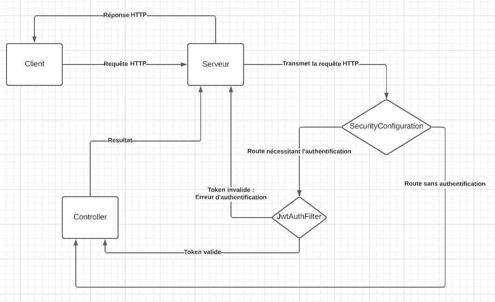
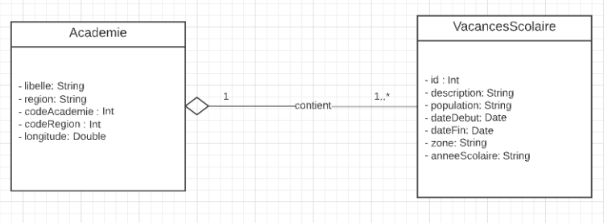

# **Vacances API**


# **Projet de Technologie Web Côté Serveur**

**Projet réalisé par :**


* **CAUBERE Maël :** [mael.caubere@etu.univ-nantes.fr](mailto:mael.caubere@etu.univ-nantes.fr)
* **MANDOU Hugo :** [hugo.mandou@etu.univ-nantes.fr](mailto:hugo.mandou@etu.univ-nantes.fr)

Dans le cadre du cours de Technologie Web Côté Serveur, nous avons créé une API Rest en Kotlin avec le framework Spring Boot. Cette API relie 2 jeux de données qui sont :


* **[Les Académies françaises](https://www.data.gouv.fr/fr/datasets/contour-academies-2020/)**
* **[Les Vacances Scolaires](https://www.data.gouv.fr/fr/datasets/le-calendrier-scolaire/)**

L’API contient un système d’authentification utilisant JWT (JSON Web Token) pour les routes avec un système de Rôle en fonction de la méthode :


GET/POST : Rôle USER ou plus.
PUT/DELETE : Rôle ADMIN.

Pour être authentifié avec le token, il faut ajouter une authorization de type Bearer à l’header de la requête.

**Les routes accessibles sans authentification sont :**

* /api/v1/documentation
* /api/v1/auth/register
* /api/v1/auth/authenticate

**Pour les autres routes il y a :**

* /api/v1/vacances
* /api/v1/academies


**Voici un schéma du fonctionnement de l’authentification :**




## **Documentation**

Route :


* /api/v1/documentation

La documentation contient tous les éléments à savoir pour la bonne utilisation de l’API Vacances. Celle-ci a été réalisée avec Swagger.


## **Authentification**

Routes :

* /api/v1/auth/authenticate
* /api/v1/auth/register

La route register permet de créer un utilisateur avec comme rôle USER et renvoie son token JWT.
Les routes register et authenticate renvoie le token à ajouter dans le header de la requête (Authorization de type Bearer) 

Pour avoir un accès ADMIN il faut s’authentifier avec les utilisateurs suivants :

```
{
    "email": "mael.caubere@etu.univ-nantes.fr",
    "password": "mael.caubere"
}

{
    "email": "hugo.mandou@etu.univ-nantes.fr",
    "password": "hugo.mandou"
}
```

## Vacances Scolaires

**Routes :**

* /api/v1/vacances
* /api/v1/vacances/{id}


## Academies

**Routes :**

* /api/v1/academies
* /api/v1/academies/{libelle}





Une _Academie_ à une liste de _VacancesScolaire_ pouvant être vide \
Une _VacancesScolaire_ contient obligatoirement une académie


## Lancement du projet

**Pour lancer le projet, il y a plusieurs façon :**
\
En ligne de commande, à la racine du projet, avec cette commande :  \
`./gradlew bootRun`

Par une IDE comme IntelliJ, en lançant le main du fichier : \
`src/main/kotlin/fr/iutna/lpmiar/rest/ProjetApplication.kt`
